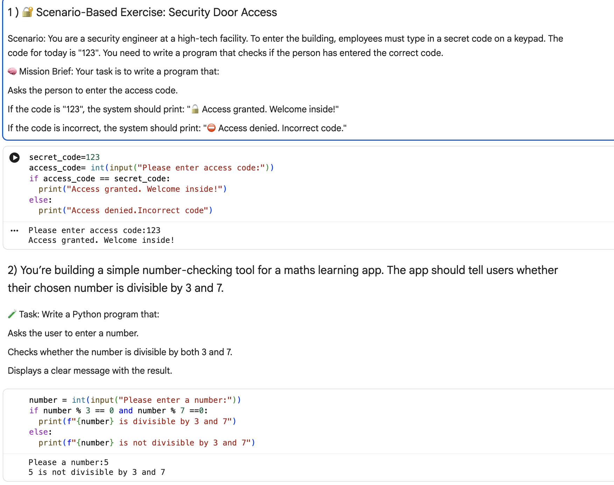
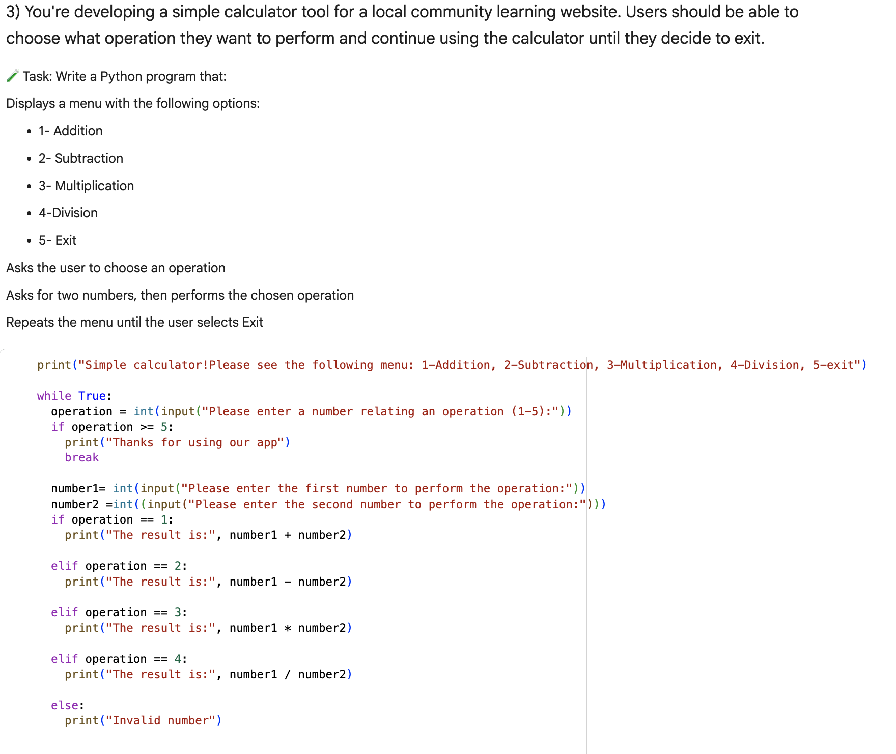
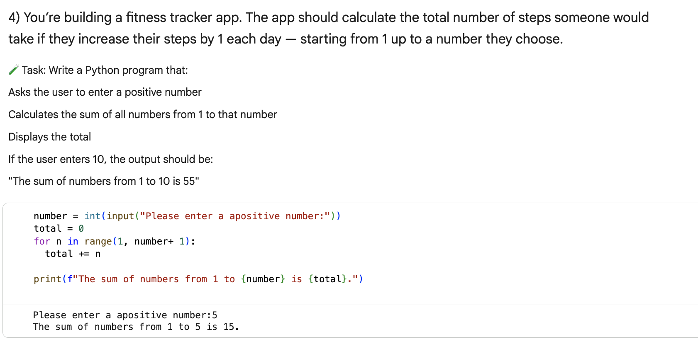
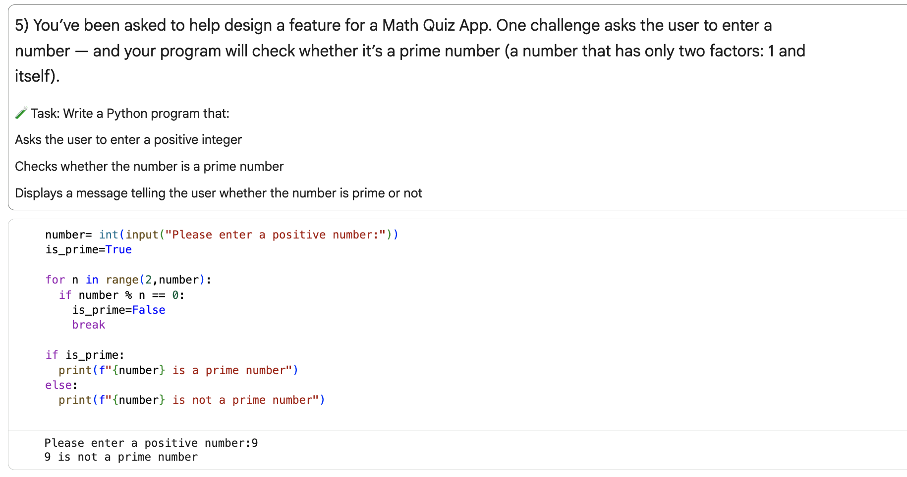
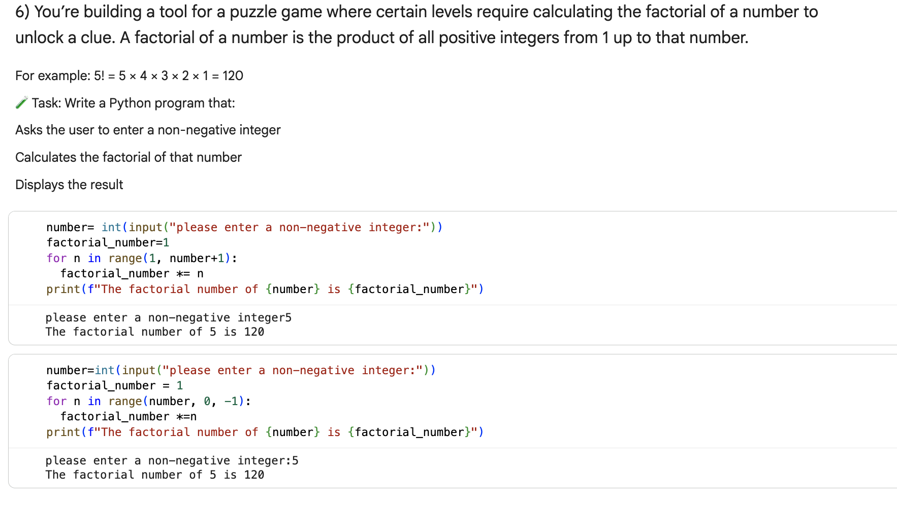

# 🧠 Python-Fundamentals-Part2

## 📘 Overview
This project contains a series of exercises focused on mastering **control flow**, **loops**, and **basic program logic** in Python.  
Through these activities, I practiced applying conditions, loops, and validation to build simple interactive programs.

---

## 🎯 Skills I Developed  
By completing this project, **I achieved the following learning goals**:

### 🔀 Mastering Conditional Statements  
- ✅ I learned to use **if**, **elif**, and **else** statements to control the flow of a program.

---

### ➗ Using the Modulus Operator  
- ✅ I can now apply the **modulus operator (%)** to check number properties such as even/odd checks and divisibility.

---

### 🔐 Input Validation & Authentication Logic  
- ✅ I implemented **input validation** and used **string comparisons** to build basic user authentication logic  
  (e.g., checking username/password, handling invalid input).

 
 
---

### 🔁 Controlling Loops with Conditions  
- ✅ I used **while loops** to repeat tasks based on conditions such as success criteria or attempt limits.
  

---

### 📋 Combining Logic for Interactive Programs  
- ✅ I combined loops and decision-making logic to create simple interactive programs like menu-driven systems.

---

### 🔢 Practicing For Loops  
- ✅ I practiced using **for loops** with the `range()` function to iterate over numbers efficiently.

---

The repository also includes:  
📁 A folder containing **screenshots** of my work  
📄 A **copy of the original Google Colab file** used during the exercises  

---

## 🧠 Skills Developed (Summary)
- 🔹 Python control flow (if / elif / else)  
- 🔹 Looping structures: `while` and `for`  
- 🔹 Input handling and validation  
- 🔹 Simple authentication logic  
- 🔹 Use of `%` for divisibility and number checks  
- 🔹 Menu-driven program logic  
- 🔹 Code organization and clean structure

  Thanks for visiting this project! 🚀  

